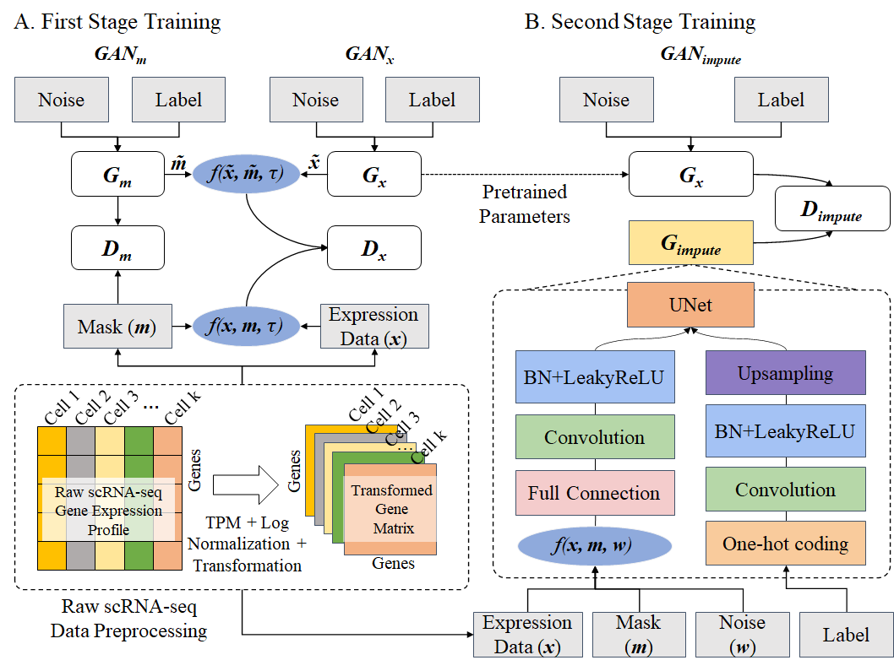

# scMultiGAN: accurate cell-specific imputation method for single-cell transcriptomes using multiple deep generative adversarial networks
The wide application of single-cell RNA sequencing (scRNA-seq) technology has made it possible to identify cell types and study cell states at a single-cell level. However, the existence of missing values is a critical issue that needs to be addressed during scRNA-seq data analysis. Although numerous computational imputation approaches have been proposed, many existing methods rely on simplistic assumptions about the data while ignoring the gene-gene expression dependencies. This can lead to imprecise gene expression estimates, especially in cases where there is complex scRNA-seq data distribution.  This paper proposes a deep learning model called scMultiGAN based on Generative Adversarial Networks (GAN) to tackle the missing value problem. Unlike traditional GAN-based imputation methods which generate the missing values based on random noises, scMultiGAN utilizes a two-stage training process with the collaboration of multiple GANs, which enables accurate cell-specific imputation. Experimental results demonstrate the effectiveness of scMultiGAN in  imputation accuracy, cell clustering, gene differential analysis, and trajectory analysis, outperforming existing methods. Furthermore, scMultiGAN is salable to large scRNA-seq datasets and works stable across sequencing platforms.
## 描述
The input to scMultiGAN is a pre-processed count single cell matrix, with columns representing cells and rows representing genes. It's output is an imputed count matrix with the same dimension. The complete pipeline and the datasets used in the paper is described with the following image.



## Environment Requirement
1. `R version > 3.5`
* argparse  
2. `Python 3.7`
* Pytorch > 1.0
* Numpy  1.18
* Pandas 1.3.5
* Pathlib
* torchvision 0.13.0
## Dataset
We used a demo dataset that contains the no-imputed data and the corresponding cell label files. For more details, please see the `data`
## scMultiGAN parameters:
1. `generate.data.R`
```bash
--expression_matrix_path  #str, path of the raw data
--file_suffix             #str, suffix of the input file, "csv" or "txt/tsv"
--label_file_path         #str, path of the label file
```
3. `train_scMultiGAN.py`
```bash
--epoch            #int
--batch-size       #int
--lr               #int, learning rate
--save-interval    #int, the number of times the model is saved after training.
--tau              #int
--alpha            #int, the training hyperparameters, 0 means that the data GAN and mask GAN are trained separately, otherwise it means joint training. for more details, please see the article’s formula explanation.
--lambd            #int, the training hyperparameters, used to adjust the ratio between Wasserstein distance and gradient penalty.
--n-critic         #int, the number of times the discriminator is trained before the generator starts training.
--latent_dim       #int, the length of the vector that inputs noise.
--d_file           #str, the path of the gene expression matrix.
--c_file           #str, the path of the label file.
--channels         #int, the number of the image channels.
--img_size         #int, the size of the image after data transformation.
--ncls             #int, the number of the cell-type.
--output_dir       #str, the path of the output directory.
--checkpoint       #str, the path of the checkpoint model.
--num_workers      #int, the number of the cores for loading data from disk
```
3. `train_scMultiGAN_impute.py`  
Same parameter definition as above. Additional parameter definition as follows.
```bash
--pretrain         #str, data generator's model trained from train_scMultiGAN.py.
--imputeronly      #flag, if used, it means only imputing is performed without additinoal training.
--imputer_model    #str, path of the imputer model for imputing expression data.
```
## An example to run scMultiGAN
1. Data preprocessing process
* `Rscript generate.data.R --expression_matrix_path "raw.txt" --file_suffix "txt" --label_file_path "label.txt" `  
&emsp;
Running this code will generate input data for GAN network training and output two parameters required for training on the screen, `img_size` 和 `ncls`。
2. Train scMultiGAN
* `python train_scMultiGAN.py --epoch 100 --batch-size 12 save-interval 10 --d_file "scMultiGAN.csv" --c_file "label.txt" --img_size img_size --ncls ncls --output_dir "./" --lr 1e-4`  
&emsp;
The `scMultiGAN.csv` is the output of the `Data preprocessing process`  
3. Train scMultiGAN_impute
* `python train_scMultiGAN_impute.py --epoch 100 --batch-size 12 save-interval 10 --d_file "scMultiGAN.csv" --c_file "label.txt" --img_size img_size --ncls ncls --lr 1e-4 --pretrain "model/0001.pth --checkpoint "model_impute/0001.pth" "--output_dir "./"`  
&emsp; 
When the `imputeronly` parameter is not used, load the pre-trained model of `train_scMultiGAN.py` and load the checkpoint model.
* `python train_scMultiGAN_impute.py --d_file "scMultiGAN.csv" --c_file "label.txt" --imputer_model "model_impute/0001.pth" "--output_dir "./"`   
&emsp;
When the `imputeronly` parameter is used, load the imputer model of `train_scMultiGAN_impute.py` to impute expression matrix.
## Acknowledgments
We are very grateful to Li et al. and Xu et al., whose source code has been very helpful to us. You can open their project code at the following links: [scIGANs](https://github.com/steveli/misgan) 和 [MisGAN](https://github.com/xuyungang/scIGANs)。
